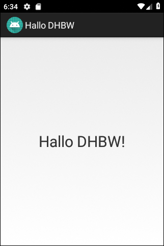

# Android-App "Hallo DHBW #

 

Der Quellcode für eine einfache "Hello World!"-App (zeigt nur statischen Text) als Projekt für 
*Android Studio*.

 

UI texts and JavaDoc comments are in German only.

 

----

## Screenshot ##

 

Screenshot aus Emulator

 

----

## License ##

 

See the [LICENSE file](LICENSE.md) for license rights and limitations (BSD 3-Clause License).

 